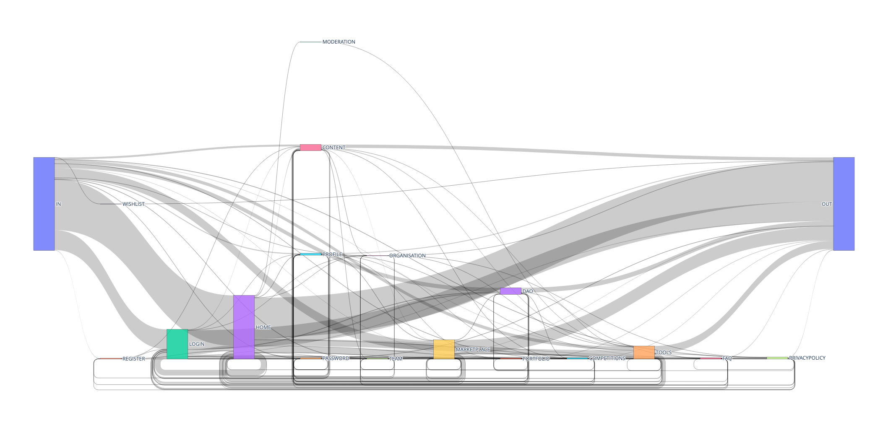

# MatomoMetrics
This software reads the content of a Matomo DB tracking a particular website and calculates metrics such as average time from one page to another on the website (see figure):

It also displays flows across categories of pages (see figure):

In order to do so, each page on the website needs to be assigned to a particular category.

## Acknowledgements

This software has been developed in the scope of the .

Dafne+ has received funding from the European Union's Horizon Europe Research and Innovation programme under Grant Agreement No. 101061548.
